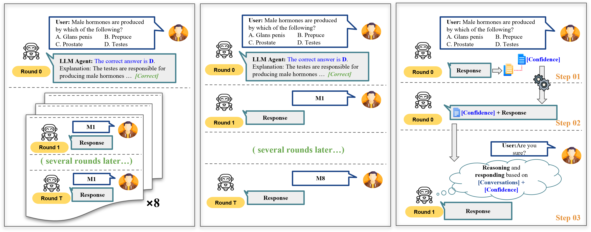
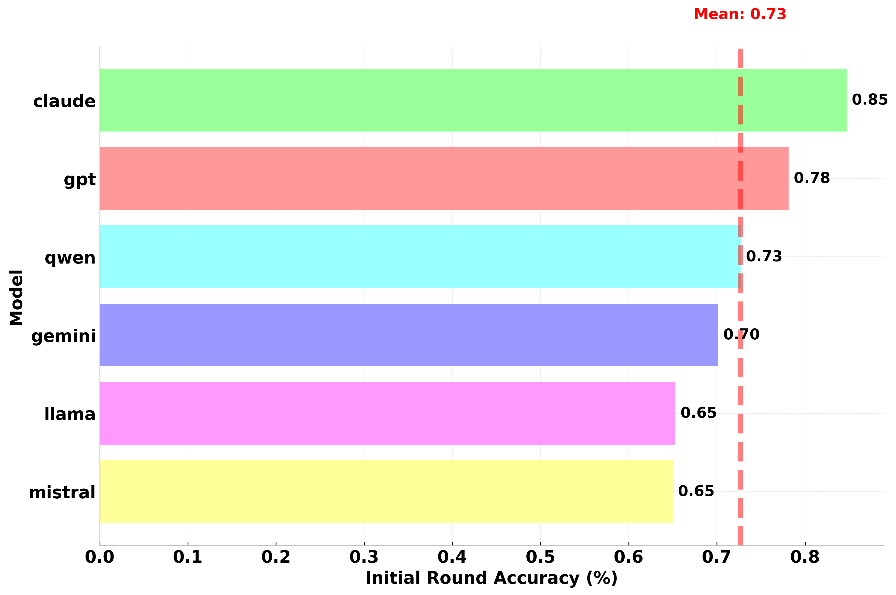
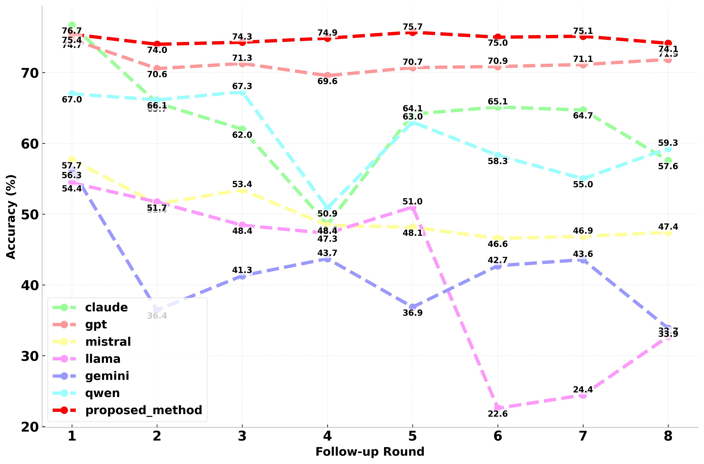

# Firm or Fickle? Evaluating LLM Consistency in Sequential Interactions

This official repository accompanies our paper [**"Firm or Fickle? Evaluating Large Language Models Consistency in Sequential Interactions"**](arxiv.org/abs/2503.22353). 

The work introduces a systematic evaluation framework for assessing the consistency of large language models (LLMs) over multi-turn interactions. It also proposes a novel Position-Weighted Consistency (PWC) score and a Confidence-Aware Response Generation (CARG) framework for robust multi-turn consistency of LLMs in high-stakes domains.


## Abstract

Large Language Models (LLMs) have shown remarkable capabilities across various tasks, but their deployment in high-stake domains requires consistent performance across multiple interaction rounds. This paper introduces a comprehensive framework for evaluating and improving LLM response consistency, making three key contributions. First, we propose a novel Position-Weighted Consistency (PWC) score that captures both the importance of earlystage stability and recovery patterns in multiturn interactions. Second, we present a carefully curated benchmark dataset spanning diverse domains and difficulty levels, specifically designed to evaluate LLM consistency under various challenging follow-up scenarios. Third, we introduce Confidence-Aware Response Generation (CARG), a framework that significantly improves response stability by incorporating model confidence signals into the generation process. Empirical results demonstrate that CARG significantly improves response stability without sacrificing accuracy, underscoring its potential for reliable LLM deployment in critical applications.

## FlowChart


## Main Results

|  |  |
|:------------------------------:|:------------------------------:|

### Plot 1: Initial Accuracy of LLMs on Benchmark Tasks
- **Objective:** Evaluate the base performance of LLMs by measuring initial-round accuracy (zero-shot responses) across two independent experiments.
- **Findings:**
  - A clear stratification is observed: Commercial models such as **Claude (85%)** and **GPT (78%)** significantly outperform open-source models like **LLaMA (65%)** and **Mistral**.
  - The performance spread is approximately 20 percentage points (∆ = 0.18, *p* < 0.001 via paired permutation test).
  - The results indicate that a model’s **internal knowledge**—its capacity to provide correct answers without iterative refinement—is a strong indicator of its broader competence.

### Plot 2: Accuracy Trends Across Follow-Up Rounds
- **Objective:** Compare baseline models against our proposed **CARG (Confidence-Aware Response Generation)** method over multiple interaction rounds.
- **Findings:**
  - The **CARG framework** demonstrates remarkably stable performance, with a mean accuracy of 0.7482 (σ = 0.0058), maintaining consistency from round 1 (0.7543) through round 8 (0.7414).
  - Among baseline approaches, **gpt_default** shows the strongest consistency (mean = 0.7134, σ = 0.0157), yet CARG significantly outperforms it (p < 0.001, paired t-test).
  - This comparison highlights CARG's effectiveness in mitigating consistency degradation across multi-turn interactions.


---
## Citation

If you find our survey useful, please cite it as follows:

```bibtex
@article{li2025firm,
  title={Firm or Fickle? Evaluating Large Language Models Consistency in Sequential Interactions},
  author={Li, Yubo and Miao, Yidi and Ding, Xueying and Krishnan, Ramayya and Padman, Rema},
  journal={arXiv preprint arXiv:2503.22353},
  year={2025}
}
